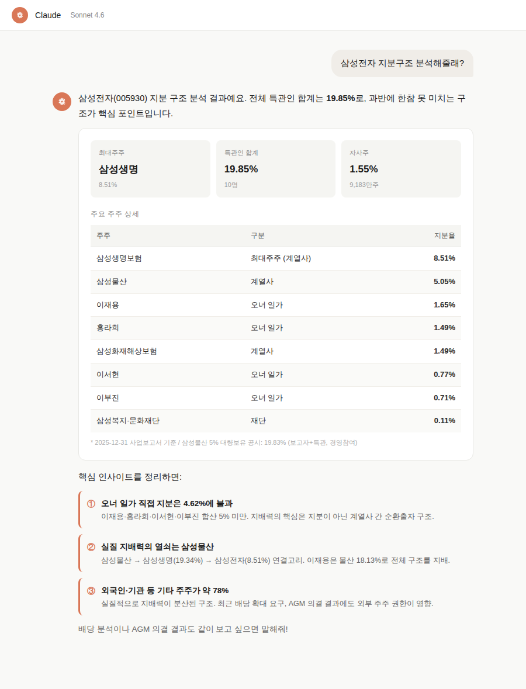
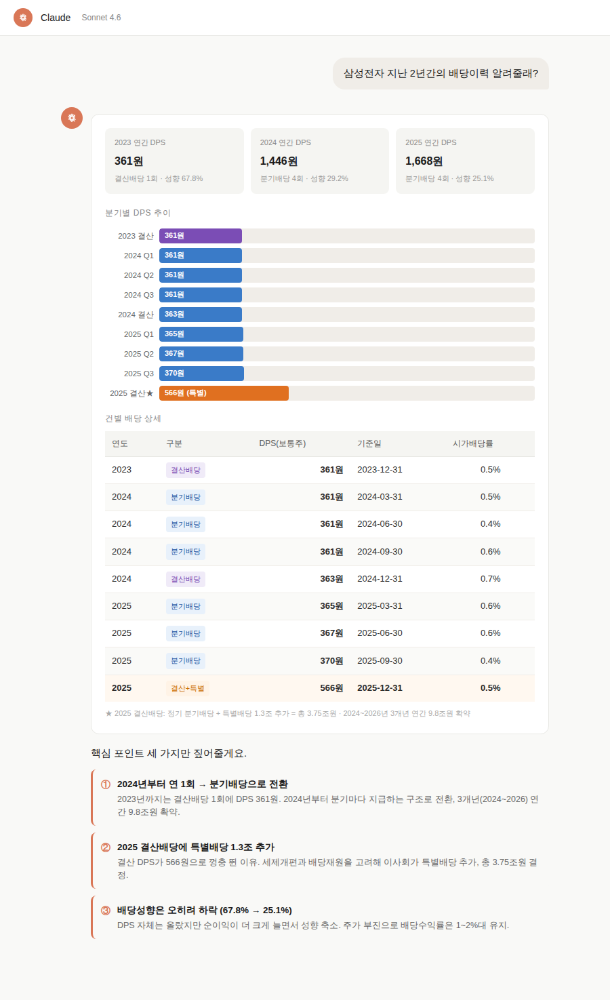
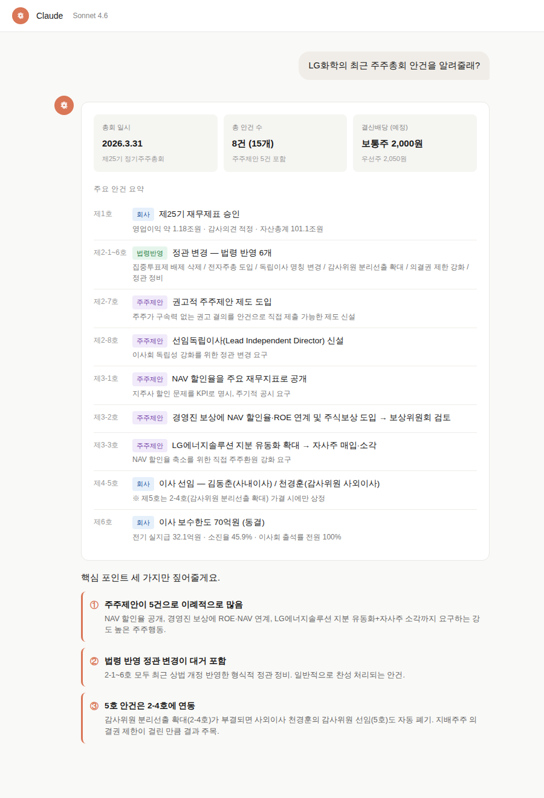
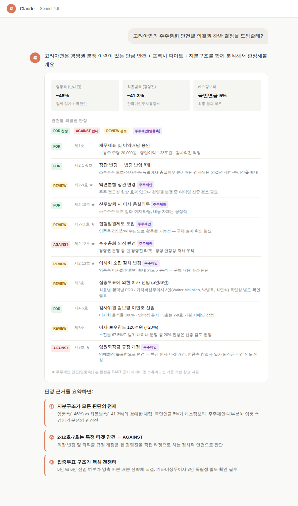

# OpenProxy MCP

[](https://creativecommons.org/licenses/by-nc/4.0/)
[](https://www.python.org/downloads/)
[](https://modelcontextprotocol.io/)

[English README](README_ENG.md)

---

**OpenProxy MCP**는 한국 상장사의 주총, 지분, 배당, 위임장 공시 데이터를 Claude AI와 연결해주는 도구예요.

Claude에게 "삼성전자 올해 주총 안건 알려줘"라고 물으면, DART 공시를 직접 뒤져서 정리해줘요.

---

## 이런 걸 할 수 있어요

| 질문 예시 | 사용 tool |
|-----------|-----------|
| "삼성전자 2025년 주총 안건이 뭐야?" | `shareholder_meeting` |
| "삼성전자 최대주주 지분 구조 보여줘" | `ownership_structure` |
| "삼성전자 최근 3년 배당 이력 알려줘" | `dividend` |
| "고려아연 위임장 분쟁 타임라인 정리해줘" | `proxy_contest` |
| "LG화학 밸류업 계획 핵심 내용이 뭐야?" | `value_up` |
| "이 주총 안건에 어떻게 투표할지 브리프 만들어줘" | `prepare_vote_brief` |









---

## 연결 방법 (Claude.ai 기준)

### 1단계 — 커스텀 커넥터 추가

Claude.ai 접속 후 좌측 하단 **설정 → 커스텀 커넥터 → 새 커넥터 추가**

아래 URL을 입력하세요:

```
https://open-proxy-mcp.fly.dev/mcp?opendart=YOUR_DART_API_KEY
```

> DART API 키가 없으면 [DART OpenAPI](https://opendart.fss.or.kr/uat/uia/egovLoginUsr.do)에서 무료로 발급받을 수 있어요.


### 2단계 — 도구 권한 허용

커넥터 추가 후 도구 권한을 **항상 허용**으로 설정하세요.


### 3단계 — 바로 사용

Claude에게 자연어로 물어보면 돼요.

```
삼성전자 2026년 주총 이사 후보 누구야?
```

---

## 제공 도구 (11개)

| 도구 | 설명 |
|------|------|
| `company` | 기업 기본 정보 + 최근 공시 목록 |
| `shareholder_meeting` | 주총 안건 / 이사후보 / 보수한도 / 결과 |
| `ownership_structure` | 최대주주 / 5% 대량보유 / 지분 구조 |
| `dividend` | 배당 이력 / DPS / 배당성향 |
| `treasury_share` | 자사주 취득·처분·소각·신탁 이벤트 |
| `proxy_contest` | 위임장 경쟁 / 소송 / 5% 시그널 |
| `value_up` | 기업가치 제고 계획 (밸류업) |
| `evidence` | 공시 원문 링크 제공 |
| `prepare_vote_brief` | 의결권 행사 메모 작성 |
| `prepare_engagement_case` | 주주관여 케이스 메모 |
| `build_campaign_brief` | 캠페인 브리프 작성 |

---

## 데이터 출처

모든 데이터는 공개된 공시에서만 가져와요.

- **DART** (금융감독원 전자공시) — 주총 공고, 사업보고서, 대량보유 보고서 등
- **KIND** (한국거래소) — 주총 결과, 수시공시
- **네이버** — 주가 참고

데이터를 저장하지 않아요. 질문할 때마다 실시간으로 공시를 조회해요.

---

## 분석 대상

**KOSPI 200** 기준으로 검증됐어요 (199개 종목).

---

## 주의사항

- AI는 공시 내용을 요약·정리해주지만 오류가 있을 수 있어요.
- 최종 투자 판단이나 의결권 행사 결정은 반드시 원문 공시와 전문가 검토를 함께 해주세요.

---

## 라이선스

[CC BY-NC 4.0](https://creativecommons.org/licenses/by-nc/4.0/) — 비상업적 사용만 허용돼요.
