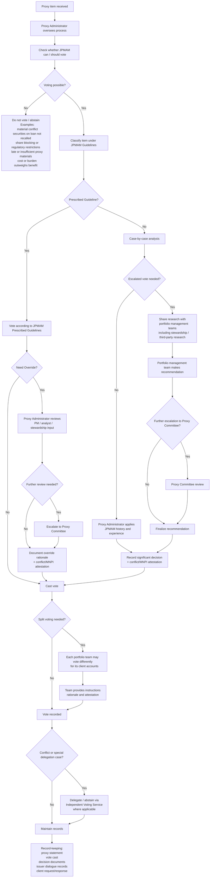

1. Admin: Proxy Administrator
2. Decision: Prescribed guideline vs. Case-by-Case Exception
3. Exception: Override, Escalation, Split Voting, Conflict Delegation
4. Control: Proxy Committee, Record-keeping

## ASIA ex-Japan Proxy Voting Guidelines

