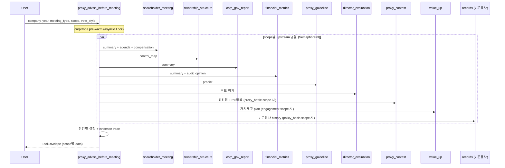

# proxy_advise_before_meeting

## 한 줄 요약
주총 **소집 전** 다각도 심층 분석 + 안건별 의결권 권고 (FOR/AGAINST/REVIEW) + 결정 근거 확보. 운용사가 한 회사를 검증 가능하게 파악 후 결정하기 위한 통합 진입점.

## 핵심 차이 (vs 옛 advise_vote_before_meeting)
- **rename + scope 확장** (1 → 10 scope)
- 옛 `prepare_vote_brief` 폐기 (사후 brief는 [[proxy_result_after_meeting]].brief로 이동)
- 옛 `prepare_engagement_case` 흡수 → `engagement` scope
- 옛 `build_campaign_brief` 사전 부분 흡수 → `proxy_battle` scope
- multi-upstream-pattern 5 요소 적용 ([[architecture/multi-upstream-pattern]])

## 사용법
```python
proxy_advise_before_meeting(
    company="KT&G",
    year=2025,
    meeting_type="annual",
    vote_style="open_proxy",
    scope="decisions",       # 단일 또는 "all"
    enable_marco=False,
)
```

## 입력 인자
| 인자 | 타입 | 필수 | 설명 | 기본값 |
|---|---|---|---|---|
| company | str | yes | 회사명 / ticker / corp_code | - |
| year | int | no | 사업연도 | 자동 (전년) |
| meeting_type | str | no | "annual" / "extraordinary" | "annual" |
| vote_style | str | no | open_proxy / nps / a_activist / b_foreign / k_legacy 등 | "open_proxy" |
| scope | str | no | 10 scope 중 하나 또는 "all" (모두 통합) | "decisions" |
| enable_marco | bool | no | Marco 시나리오 활성 (과거 회사 cross-check) | False |
| format | str | no | "md" / "json" | "md" |

## 10 scope

| scope | 무엇 | 주요 upstream | 흡수 |
|---|---|---|---|
| `decisions` (default) | 안건별 FOR/AGAINST/REVIEW + 결정 사유 | 6 upstream 통합 | 옛 advise_vote |
| `agenda` | 안건 상세 트리 + 카테고리 분류 | shareholder_meeting (agenda) | - |
| `candidates` | 이사/감사 후보 평가 (독립성/충실성/결격사유 3축) | director_evaluation | - |
| `financial` | 재무 진단 (수익성/안정성/배당성향/감사의견) | financial_metrics | - |
| `governance` | 거버넌스 15지표 + 연도 추이 | corp_gov_report | - |
| `ownership` | 최대주주 + 특수관계인 + 5%블록 + 자사주 | ownership_structure (control_map) | - |
| `policy_basis` | OPM Guideline + NPS + 7 운용사 history 비교 | proxy_guideline + records | 신규 |
| `proxy_battle` | 위임장 분쟁 + 행동주의 신호 + 캠페인 컨텍스트 | proxy_contest + ownership | **campaign_brief 사전 흡수** |
| `engagement` | 회사-운용사 IR history (가치제고 plan + 대화 자료) | value_up + ownership 변동 | **engagement_case 흡수** |
| `evidence` | 결정 근거 trace (모든 fact statement → source upstream + raw 인용) | 모든 upstream raw | 신규 |

## 출력 schema (scope별)

### `decisions` (default)
```json
{
  "agenda_decisions": [
    {"agenda_title": "...", "agenda_category": "director_election",
     "decision": "FOR", "reason": "...",
     "policy_basis": "Open Proxy Guideline / open_proxy",
     "evidence_rcept_no": "..."}
  ],
  "candidates_count": 5,
  "agenda_count": 8,
  "financial_summary": {...},
  "governance_summary": {...},
  "ownership_summary": {...}
}
```

### `evidence`
```json
{
  "evidence_trace": [
    {"agenda_title": "감사인 보수 한도 승인",
     "decision": "FOR",
     "facts": [
       {"statement": "전년 보수 인상 12%",
        "source": "financial_metrics.summary",
        "raw_value": {"prev": 1200000000, "curr": 1344000000},
        "evidence_id": "fm_2024_audit_fee"},
       {"statement": "감사적정 의견",
        "source": "financial_metrics.audit_opinion",
        "raw_value": "적정",
        "evidence_id": "fm_2024_audit_opinion"}
     ],
     "policy_citations": [
       {"section": "Open Proxy Guideline v1.3 §audit_committee_election",
        "rule_id": "audit_compensation_threshold",
        "applied": "12% < 30% threshold → FOR"}
     ]}
  ]
}
```

### `policy_basis`
```json
{
  "company_query": "KT&G",
  "agenda_titles": ["감사인 보수 한도 승인", "정관 일부 변경"],
  "policy_comparison": [
    {"agenda": "감사인 보수 한도 승인",
     "open_proxy": "FOR",
     "nps": "FOR",
     "majority_7managers": {"FOR": 5, "AGAINST": 2, "ABSTAIN": 0},
     "majority_decision": "FOR",
     "our_position": "FOR (majority 동조)",
     "history_2024": {"a_activist": "FOR", "b_foreign": "FOR", ...}}
  ]
}
```

### `proxy_battle`
```json
{
  "active_5pct_blocks": [...],
  "proxy_solicitation": {"company": [...], "challenger": [...]},
  "litigation_signals": [...],
  "campaign_targets_observed": [...]
}
```

### `engagement`
```json
{
  "value_up_plan": {...},
  "ownership_changes_12m": [...],
  "ir_disclosure_history": [...],
  "previous_engagement_outcomes": [...]
}
```

## 매핑 분류 (success / soft-fail / hard-fail)
- 안건 / 후보 이름·임기·약력 / 지분 / 재무 / 감사의견 → **success**
- 후보 약력 자유 텍스트 (dutyPlan / recommendationReason) → **soft-fail** (raw 노출)
- 형사 처벌 / 사적 관계 / 동명이인 / 파산 → **hard-fail** (메모/코드 모두 침묵)
- evidence scope의 모든 fact → source upstream + raw_value 필수 (할루시네이션 0)

## 후보 평가 3축 (candidates scope)
- **독립성**: 최대주주/특수관계인 매칭 / 최근 2년 직원 / 5년 룰 / 회사와 거래 (recent3yTransactions)
- **충실성**: dutyPlan / recommendationReason raw + Marco 시나리오 (옵션)
- **결격사유**: 나이 (미성년) / eligibility 필드 (taxDelinquency / insolventMgmt / legalDisqualification)

## 안건별 결정 logic (decisions scope)
- `financial_statements`: 감사적정 + 자본잠식 normal → FOR / 자본잠식 full → AGAINST
- `director_election` / `audit_committee_election`: 후보 cross-match → FOR (clean) / REVIEW (concerns) / AGAINST (red_flag)
- `director_compensation`: 소진율 < 30% + 인상 → AGAINST / 50%+ 인상 → REVIEW
- `cash_dividend`: 배당성향 80%+ → REVIEW / 그 외 → FOR
- `articles_amendment`: 집중투표 배제 → AGAINST / 이사 정원 축소 → REVIEW
- `treasury_share`: 소각 → FOR / 처분 → REVIEW

## Flow


## 검증 (3 gate)

본 tool은 [[260503_0002_ralph_proxy-advise-verification]] ralph loop으로 3 gate 검증:

1. **일관성** — 같은 입력 → 같은 출력 (200×3 batch deterministic 100%)
2. **정확도** — 7 운용사 majority decision baseline ≥95%
3. **사실 정확성** — evidence 안 facts vs raw payload mismatch 0건

검증 통과 후 promise: `PROXY_ADVISE_VERIFIED`.

## 관련 공시
- [[주주총회소집공고]]
- [[사업보고서]]
- [[기업지배구조보고서]]
- [[가치제고 계획]] (Value-up)
- [[위임장 권유]]

## 관련 개념
- [[의결권]] / [[사외이사]] / [[감사위원]] / [[보수한도]] / [[정관변경]] / [[집중투표]] / [[자본잠식]] / [[5%블록]] / [[행동주의]]

## 흡수 매핑 (옛 tool → 새 scope)

| 옛 tool | 처리 | 흡수 위치 |
|---|---|---|
| `prepare_vote_brief` | 사후 → 새 [[proxy_result_after_meeting]].brief로 이동 | - |
| `prepare_engagement_case` | 흡수 | `engagement` scope |
| `build_campaign_brief` 사전 부분 | 흡수 | `proxy_battle` scope |
| `build_campaign_brief` 사후 부분 | 폐기 (또는 별도 캠페인 회고 tool) | - |
| 옛 `advise_vote_before_meeting` | rename + scope 확장 | `decisions` scope이 동일 logic 유지 |

## 변경 이력
- 2026-05-04: rename + 9 scope 추가 + 옛 engagement_case/campaign_brief 사전 흡수 + multi-upstream-pattern 5 요소
- 2026-05-02: 구 advise_vote_before_meeting (rename source)
